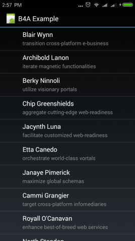
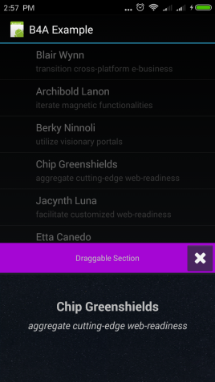

# B4A-JSSlidingUpPanel
[SlidingUpPanel](https://github.com/umano/AndroidSlidingUpPanel) Wrapped for B4A (Basic4Android)

==Copy .aar, .jar, .xml to your additional library folder==

The provided sample (source) requires additional library:
* JSON
* Android-Support-v4

You can find the additional library in [B4A Forum](https://b4x.com/android/forum/#b4a-development-tool-for-native-android-apps.25)

  

### Sample
```
Sub Globals
Private slider As JSSlidingUpPanel
....
Sub Activity_Create(FirstTime As Boolean)
	' add slider to your activity
	slider.Initialize("")
	Activity.AddView(slider, 0dip, 0dip, 100%x, 100%y)
    
	' add slider to your activity
	slider.Initialize("")
	Activity.AddView(slider, 0dip, 0dip, 100%x, 100%y)
	
	' load main layout (designer or via code)
	Dim mainView As Panel
	mainView.Initialize("")
	mainView.LoadLayout("main")
	
	' create slide panel (designer or via code)
	Dim slideView As Panel
	slideView.Initialize("")
	slideView.LoadLayout("sliding")
    
	' set mainview and slideview, then build the slide panel
	slider.setMainView(mainView, Activity.Width, Activity.Height) _
		.setSlideUpView(slideView, 100%x, imvPattern.top + imvPattern.Height).Build
	
	' our layout is designed for bottom view, set initial height to 0
	slider.setGravity(Gravity.BOTTOM) _
		.setPanelHeight(0dip)
        
	' limit dragrabble view to button (optional)
	slider.setDragView(btnClose)    
```

### Acknowledgement
* Image Pattern - https://www.toptal.com/designers/subtlepatterns/
* Umano SlidingUp Panel - https://github.com/umano/AndroidSlidingUpPanel

